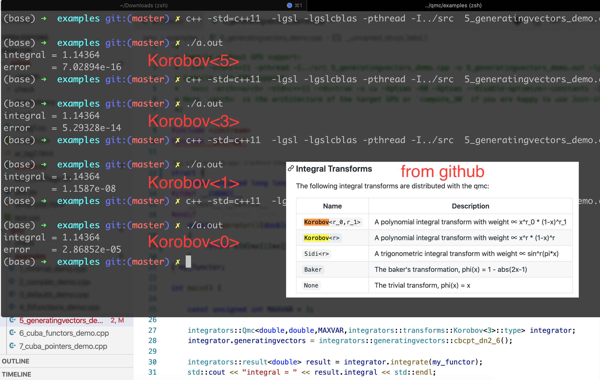

# gsl

mean, varience 求法參照 [gsl](https://www.gnu.org/software/gsl/doc/html/statistics.html)

$$
\hat{\mu}=\frac{1}{N} \sum x_{i}
$$
$$
\hat{\sigma}^{2}=\frac{1}{(N-1)} \sum\left(x_{i}-\hat{\mu}\right)^{2}
$$

```cpp
// 將vector 轉換成 array 輸入資料
tvar.push_back( (parms.const_a*x[i-2]+parms.const_a*x[i-1]+x[i-1]) );
//calc variance
double data[tvar.size()]; 
std::copy(tvar.begin(), tvar.end(), data); // [begin,end)
mean = gsl_stats_mean(data, 1, i+1); // 找data[1]~data[i+1]的mean
variance = gsl_stats_variance(data, 1, i+1);
```

# Quasi Monte Carlo 積分測試

由於數值出來都是差不多，所以直接用範例用的`korobov<3>`


# 參考論文 

[Github Project link](https://github.com/mppmu/qmc)

A Generic C++ Library for Multilevel Quasi-Monte Carlo